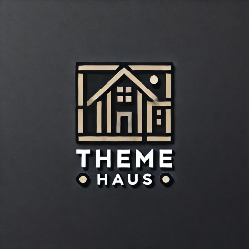

# Theme Haus



**Theme Haus** is a collection of **CSS themes and templates** designed for improved **readability, aesthetics, and usability** across various platforms. This repository serves as a central hub for managing and sharing stylesheets, templates, and design resources.

## 🎨 Haus Readable

**Haus Readable** is the first theme in this collection, focusing on **clarity, accessibility, and a clean reading experience**. It features:
- The **Inter** font from FontBunny for optimal readability.
- A **responsive, typography-first layout** designed for blogs and text-heavy pages.
- **Light & dark mode support** with soft color contrasts.

👀 View the [Haus Readable](css/omg.lol/haus-readable.css) CSS. 

## 📂 Directory Structure

```plaintext
css/
├── omg.lol/
│   ├── haus-readable.css
│   ├── ...
html/
├── omg.lol/
│   ├── haus-readable-landing-page-template.html
│   ├── haus-readable-page-template.html
│   ├── haus-readable-template.html
```

## 🚀 How to Use

1. Upload the relevant CSS file to your platform.
2. Reference it in your templates with:

   ```html
   <link rel="stylesheet" href="https://your-hosted-location.com/css/haus-readable.css">
   ```

3. Enjoy a **beautiful, readable experience** across your sites!